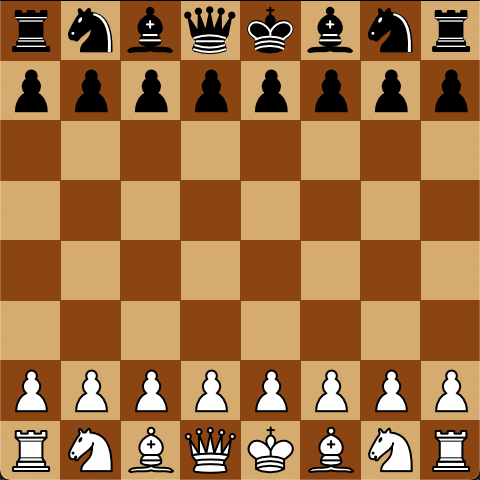
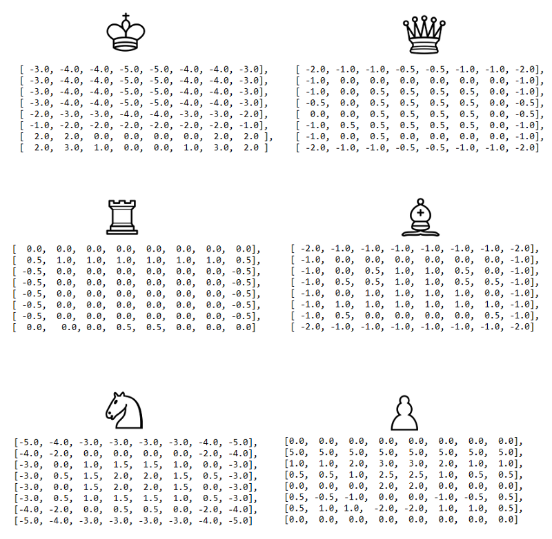
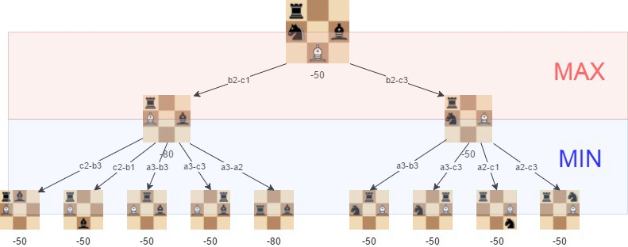

AI-Plays-Chess
=================

Introduction
------------
Chess is a tactical game where each player has 16 pieces. The goal of the game is to capture your opponent's King while keeping your own well-guarded. Here I made an AI using the mini-max algorithm with alpha-beta pruning and multithreading that tries to defeat the player playing against it.



Installing Packages
-------------------
Packages used:

```python
import pygame
import sys
import numpy as np
from copy import deepcopy
from concurrent.futures.process import ProcessPoolExecutor
```

Installing package, run:

```terminal
pip install pygame, numpy
```

Run Script
----------
To run the chess game: 

```
python Chess.py
```

Heuristic Function
------------------
Since there are so many possible moves to take after any move, it is nearly impossible to simulate each possible move until we reach a checkmate, hence we need a heuristic function to predict what state the board will be in the future. For my heuristic function, I took account to the amount of pieces each player had, how much each piece was worth (shown beneath), and which position each piece was since it is always better to have your pawns and knights near the middle than having it on the sides of the board (points can be found inside the Pieces.py file).

Piece points:
| Piece         | Points        |         
| ------------- | ------------- |
| Pawn          | 10            |
| Knight        | 30            |
| Bishop        | 32            |
| Rook          | 50            |
| Queen         | 90            |
| King          | 900           |

Piece position points:



Minimax algorithm
-----------------
Minimax is a recursive algorithm to determine what is the best next move to take. For each recursive step, when we are finding the best move for white to take, we want to maximise the value, and when we are finding the best move for black to take, we want to minimise the value. This is because the heuristic function returns a negative number if it favours the black side more and a possible number if it favours the white side more.

Here I started the recursion from the black side since the player always goes first, since we want to find the best move to make for the black pieces, we want to minimise the value from the minimax algorithm since that indicates it favours the black side more. The best move that the AI will take is the move that gives the lowest value from the minimax algorithm.



Alpha-beta pruning
------------------
Since there are so many possible moves to take after evaulating an initial move, there will be a lot of unnecessary moves that don't need to be calculated. I first initialise alpha and beta to be -5000 and 5000 respectively, alpha indicates the best move for white (max value) and beta indicates the best move for black (min value). Alpha can be updated only when it’s white’s turn and, similarly, beta can be updated only when it’s black’s turn. If alpha becomes greater or equal to beta, we can prune it. 

While backtracking the tree, the node values will be passed to upper nodes instead of values of alpha and beta and will only pass the alpha, beta values to the child nodes.

Multithreading
--------------
In order to optimise evaluating the values, I used multithreading to run the minimax in parallel. Since I initially ran the minimax for each type piece, e.g Rook list, Pawn list etc, I gave each list a thread to run in parallel, since there are 6 types of pieces, there are 6 threads that run in parallel. I used ProcessPoolExecutor to initialise a pool with a size of 6 and giving each thread a task that finds the best value from minimax. I used ProcessPoolExecutor because it can get around the python "GIL lock" so that it can actually run in parallel. In order to ensure that there are no race coniditions, the tasks don't change the original data directly, instead it makes a copy of it and changes the data in that copy, this avoids any reads and writes to the same global variables and hence will remove any possible race conditions.  

```python
executor = ProcessPoolExecutor(max_workers=6)
```

In order to ensure that there is no busy waiting, I added all the futures in a list first so that the threads will be running while other threads are getting added to the list. After all futures are intialised, it retrieves the results back in another for loop once the futures are done executing.

```python 
for pieceList in black_copy.getPieces():

    future = executor.submit(findBestValue, pieceList, white_copy, black_copy, board_copy, depth, alpha, beta)
    futureList.append(future)

for future in futureList:
    value, move = future.result()
```

Resources
---------
https://www.chessprogramming.org/Simplified_Evaluation_Function


